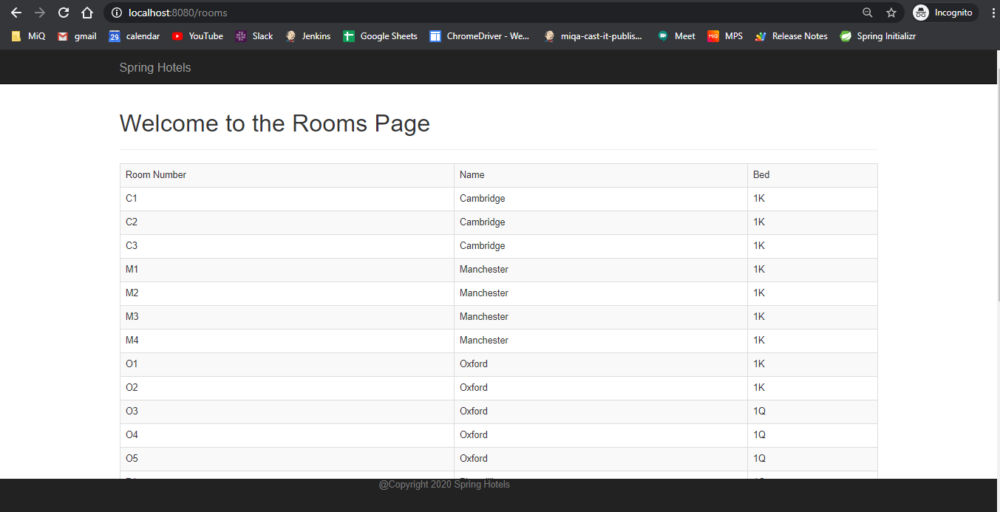

## Spring and Spring Boot Learning

This repository contains code for hotel management done during my linkedIn online training.

 

#### The schema contains three table
- ROOM
- GUEST
- RESERVATION
    
 

Room Table          | -
------------------- | -----------------------------
ROOM_ID             | (AUTO_INCREMENT) PRIMARY KEY
NAME VARCHAR(16)    | NOT NULL
ROOM_NUMBER         | CHAR(2), NOT NULL, UNIQUE
BED_INFO            | CHAR(2), NOT NULL

 

Guest Table     | -
--------------- | -----------------------------
GUEST_ID        | (AUTO_INCREMENT) PRIMARY KEY
FIRST_NAME      | VARCHAR(64)
LAST_NAME       | VARCHAR(64)
EMAIL_ADDRESS   | VARCHAR(64)
ADDRESS         | VARCHAR(64)
COUNTRY         | VARCHAR(32)
STATE           | VARCHAR(12)
PHONE_NUMBER    | VARCHAR(24)

 

Reservation Table   | -
------------------  | ---------------------------
RESERVATION_ID      | (AUTO_INCREMENT) PRIMARY KEY
ROOM_ID             | BIGINT NOT NULL
GUEST_ID            | BIGINT NOT NULL
RES_DATE            | DATE

#### Functionality
- Get Reservation Details by date (return all if no reservation on particular date)
- Get Guest List in ascending order of last name
- Get room details in ascending order of room number
- Get list of all reservations in json

#### Screenshots

* Home Page (localhost:8080)

 
 

* Rooms Page (localhost:8080/rooms)

 
 

* Guests Page (localhost:8080/guests)

 
 

* Reservations API (localhost:8080/api/reservations?date=2020-01-01)

